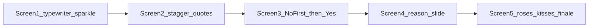
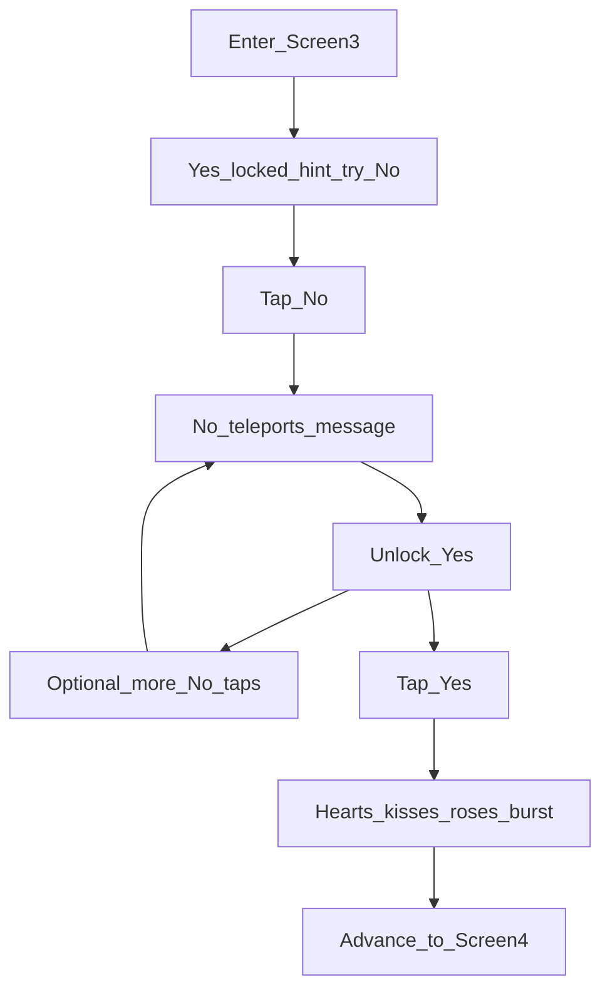

# Creative Animations Boost

## Constraint
Keep everything in [index.html](index.html), [styles.css](styles.css), [script.js](script.js) — no libraries/CDN. Preserve `prefers-reduced-motion` and the mobile layout work already done. Plan file: [`creative_animations.plan.md`](creative_animations.plan.md) in the project root (not `~/.cursor/plans/`).

## Creative direction (chosen)
**Both layers at once:**

1. **Romantic playful** — affection motifs: hearts, roses (emoji/CSS petals), kisses (💋), soft blush tones — feels flirty and loving, not cold UI polish
2. **Gimmicky page effects** — keep the fun “website toy” energy: typewriter, card shimmer, stagger reveals, dodging No, shake/bounce, big confetti finale

Tone: boyfriend surprise that is sweet *and* cheeky — roses/kisses in the atmosphere, gimmicks in the interactions.

## What exists today
- Floating hearts only, fade transitions, Yes pulse, reason stagger, Yes heart-burst, canvas confetti
- Screen 3 dodges on `mouseenter` + `touchstart` — on mobile there is no cursor; she can tap Yes first and miss the playful No

## Enhancements by screen

### Global — romantic motifs + gimmicks
- **Particle mix** in `.hearts-bg`: float ♥ / 🌹 / 💋 (and soft petal-like pink circles via CSS spans) — random mix, not hearts-only
- **Active-screen stagger** (gimmick): children fade/scale in with delays
- **Richer transitions** (gimmick): leave `scale(0.97)` + fade; enter `translateY(20px)` → 0
- **Card shimmer** (gimmick): soft rose-gold `::after` sweep
- **Button press** + **progress-dot pop** (gimmick)
- **Mobile budget**: fewer particles on small screens (e.g. 6 vs 12); still mix motifs

### Screen 1 — Opening
- Typewriter headline (gimmick); CTA fades in after
- Soft sparkles + 1–2 floating rose/kiss near the card (romantic)

### Screen 2 — Memory
- Quote stagger (gimmick)
- Light “breath” on Hindlish lines; optional tiny heart pulse beside the memory line (romantic)

### Screen 3 — Playful (mobile-first, No first) — gimmick core + romantic juice

**Problem:** Phones have no hover. She must discover the dodge by tapping No before Yes unlocks.

**Behavior:**
1. Enter: **Yes locked** until `dodgeCount >= 1`; hint *“Go on… try No”* / *“Be honest — tap No”*
2. **No = tap/click only** (drop hover-as-primary); teleport + sassy messages
3. Each No: dodge, grow Yes, rotate messages
4. After first No: unlock Yes; hint → *“Okay fine… Yes is waiting”*
5. More No taps still allowed; Yes → advance
6. **Juice (both):** message shake / Yes bounce / No trail (gimmick); on Yes — burst of hearts + kisses (💋) + tiny roses instead of hearts-only; gold/rose card flash

### Screen 4 — Reasons
- Slide-in stagger (gimmick); rose/heart `::before` (romantic) instead of heart-only
- Continue button scale-in

### Screen 5 — Finale
- Typewriter / fade-up headline (gimmick)
- Love note + closing stagger
- **Confetti upgrade:** rectangles + ♥ + 💋 + 🌹 (or drawn petal/heart shapes) — longer ~4–5s, center burst then fall (romantic + gimmick)
- Ambient particle intensity spike (extra roses/kisses/hearts)

## Reduced motion
No typewriter (full text), no shimmer/shake/bounce, instant staggers, minimal/no confetti — **No-first unlock still applies**; static motif characters OK in copy if already shown.

## Files to touch
- [styles.css](styles.css) — motion keyframes; locked Yes; hint; rose-gold shimmer; particle variants
- [script.js](script.js) — motif particle spawn, No-first gate, tap dodge, typewriter, romantic confetti/bursts
- [index.html](index.html) — `#no-hint` on Screen 3
- [creative_animations.plan.md](creative_animations.plan.md) — this plan, in-repo

## Out of scope
- Sound, video, photo galleries, new screens, external animation libraries
