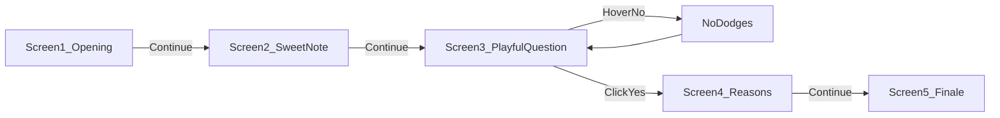

# Girlfriend's Day Multi-Screen Surprise

## What we're building

A **5-screen click-through surprise** for Girlfriend's Day — not a proposal (she's already your girlfriend), but a small journey that builds emotion screen by screen: warm intro → sweet words → playful moment → reasons you love her → grand finale.

Elegant romantic visuals (soft gradients, serif headings, glass cards) mixed with playful fun (dodging **No** button, sassy messages, confetti).

Still **frontend-only**, no build step — 4 files you upload straight to GitHub.




## File structure

```
girlfriend-day/
├── index.html      # All 5 screens + name/message placeholders
├── styles.css      # Shared theme, transitions, animations
├── script.js       # Screen navigation, No dodge, confetti
└── README.md       # Deploy + customize instructions
```

Technically one HTML file with multiple hidden `.screen` sections — feels like separate pages, works perfectly on GitHub Pages with no routing setup.

## The 5-screen journey

### Screen 1 — The surprise opens

- Floating hearts in background
- Big headline: **"Happy Girlfriend's Day, Baby Girl!"**
- Subtext: *"I made a little something just for you, baby girl..."*
- Button: **"Open your surprise →"**
- Progress dots at bottom (1 of 5 filled)

### Screen 2 — Your first meet (GGN) — the magical memory

Screen title (small label above quote): *"Where it all became real"*

- **Main line** (English, warm):
  > *"Every day with you feels like a gift. But nothing compares to the day we finally met."*
- **Memory line** (Hindlish, poetic — pre-filled from your story, editable in CONFIG):
  > *"GGN ki hawa mein pehli baar mile — club ki raat, Galleria market ki walk, movie aur tumhare saath woh saara time... sab kuch magical tha. Woh din ab bhi mere dil ka sabse khoobsurat chapter hai."*
- **Relive line** (Hindlish — emotions over places, editable in CONFIG):
  > *"Har din tumhara saath, tumhara pyaar — baar baar jeena chahta hoon, poori zindagi ke liye."*
  > *(Vibe: Every day your presence, your love — I want to live it again and again, for the rest of my life.)*
- Optional tiny footnote in italics (inside-joke slot, editable):
  > *"Still think about that day more than you know."*
- Button: **"Keep going →"**

### Screen 3 — The playful moment (moving No button)

Playful flip — *you're* the lucky one to have *him*:

> **"Aren't you the luckiest person alive to have me?"**

- **Yes** — rose/gold gradient, gentle pulse; grows each time **No** is dodged
- **No** — dodges on hover/tap with rotating messages (playful, ego-teasing):
  - *"Deny it all you want!"*
  - *"That button knows the truth"*
  - *"Luck doesn't run away like this"*
  - *"Yes is RIGHT there..."*
  - *"You know I'm right 😌"*
  - *"Wrong answer, bestie"*
- On **Yes** → show a sweet follow-up line, then advance:
  - **"And honestly? I'm the luckiest too — to have you."**
  - Brief heart burst animation
  - Auto-advance to Screen 4 after ~2s (gives her time to read it)


| Trigger                           | Behavior                                       |
| --------------------------------- | ---------------------------------------------- |
| `mouseenter` / `touchstart` on No | Random safe reposition within viewport         |
| Each dodge                        | Next sassy message + Yes scales up (max ~1.4x) |
| Click Yes                         | Mini celebration, then navigate to Screen 4    |


### Screen 4 — Reasons I love you

- Headline: **"A few reasons you're my favorite person"**
- 5 bullet lines that **animate in one by one** (staggered fade-up) — all informal Hindlish:
  1. *"Teri smile se bure din bhi theek ho jaate hain — sach mein"*
  2. *"Normal si baatein bhi tumhare saath special lagti hain"*
  3. *"Itni gussel ho, itni shaki ho — aur phir bhi mujhe choose karti ho, kaise?"*
  4. *"Jab milte hain na, bas ek dusre mein kho jaate hain — time hi nahi pata chalta"*
  5. *"Bas kyunki tum ho — aur iss se zyada kya chahiye?"*
- Button appears after last reason: **"One more thing →"**

### Screen 5 — Grand finale

- Full-screen confetti (lightweight canvas, no CDN)
- Headline: **"I love you, baby girl"**
- Personal love note (English, editable):
  > *"Thank you for being you, baby girl. Happy Girlfriend's Day — today and every day after. You're my person."*
- Animated floating hearts
- Closing line: *"Now come here — hugs, cuddles, and kisses 🤍"*
- No further button — she's reached the end

## UI polish across all screens

- **Progress dots** (5 dots, current screen highlighted) — she always knows there's more coming
- **Smooth transitions**: fade-out current screen → fade-in next (CSS + JS class toggles)
- **Consistent glass card** centered on each screen
- **Back button**: hidden on Screen 1; optional subtle back arrow on Screens 2–4 (not on finale)
- `**prefers-reduced-motion`**: skip dodge teleport, reduce confetti, use simple fades

## Design tokens (elegant + cute)

- **Fonts**: Google Fonts — `Playfair Display` (headings) + `DM Sans` (body)
- **Colors**: `#fff5f7` → lavender gradient, `#e8a0b8` accents, `#6b4c5a` text, gold on primary buttons
- **Hearts**: CSS-only floating particles on Screens 1 and 5

## Naming

**"baby girl"** is used everywhere instead of her real name. **Your name is not shown** anywhere on the site — no "From" line, no signature. Single CONFIG field for her pet name only.

## Customization block (top of `script.js`)

```js
const CONFIG = {
  herName: "Baby Girl",     // ← pet name used on every screen
  screen1Headline: "Happy Girlfriend's Day, {herName}!",  // → "Happy Girlfriend's Day, baby girl!"
  screen1Subtext: "I made a little something just for you, baby girl...",

  // Screen 2 — first meet memory (GGN)
  screen2Title: "Where it all became real",
  screen2Main: "Every day with you feels like a gift. But nothing compares to the day we finally met.",
  screen2Memory: "GGN ki hawa mein pehli baar mile — club ki raat, Galleria market ki walk, movie aur tumhare saath woh saara time... sab kuch magical tha. Woh din ab bhi mere dil ka sabse khoobsurat chapter hai.",
  screen2Relive: "Har din tumhara saath, tumhara pyaar — baar baar jeena chahta hoon, poori zindagi ke liye.",
  screen2Footnote: "Still think about that day more than you know.",

  // Screen 3 — playful flipped question
  screen3Question: "Aren't you the luckiest person alive to have me?",
  screen3DodgeMessages: [
    "Deny it all you want!",
    "That button knows the truth",
    "Luck doesn't run away like this",
    "Yes is RIGHT there...",
    "You know I'm right 😌",
    "Wrong answer, bestie"
  ],
  screen3YesReply: "And honestly? I'm the luckiest too — to have you.",

  // Screen 4 — reasons (informal Hindlish)
  screen4Headline: "A few reasons you're my favorite person",
  reasons: [
    "Teri smile se bure din bhi theek ho jaate hain — sach mein",
    "Normal si baatein bhi tumhare saath special lagti hain",
    "Itni kind ho, itni beautiful ho — aur phir bhi mujhe choose karti ho, kaise?",
    "Jab milte hain na, bas ek dusre mein kho jaate hain — time hi nahi pata chalta",
    "Bas kyunki tum ho — aur iss se zyada kya chahiye?"
  ],

  // Screen 5 — finale (English)
  screen5Headline: "I love you, {herName}",  // → "I love you, baby girl"
  loveNote: "Thank you for being you, baby girl. Happy Girlfriend's Day — today and every day after. You're my person.",
  screen5Closing: "Now come here — hugs, cuddles, and kisses 🤍"
};
```

## GitHub Pages deployment

1. Create a public repo (e.g. `happy-gf-day`)
2. Upload `index.html`, `styles.css`, `script.js`, `README.md` to repo root
3. **Settings → Pages → Source**: `main` branch, `/ (root)`
4. Share: `https://<username>.github.io/happy-gf-day/`

## What we are NOT building

- Backend, login, or analytics
- Photo gallery (names + text only, per your choice)
- Separate HTML files per screen (single-file is simpler for GitHub upload)

## Testing checklist

- All 5 screens advance correctly with Continue / Yes
- Screen 3: No dodges on desktop hover and mobile tap
- Screen 4: reasons stagger in; button appears after last one
- Screen 5: confetti fires once; "baby girl" shows correctly on all name spots
- Mobile 320px: cards and buttons stay readable
- `prefers-reduced-motion`: graceful fallback

